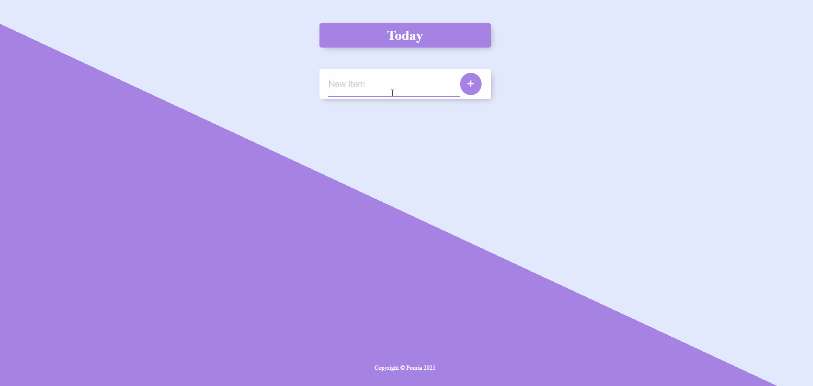

# 📝 Permalist Project

A clean and minimal **To-Do List web app** built with **Node.js**, **Express**, **EJS**, and **PostgreSQL**.  
The app lets you **add, edit, and delete** tasks with smooth transitions and live updates stored permanently in the database — hence the name **Permalist**.

---

## 🚀 Features

- 🗂️ Persistent task storage using **PostgreSQL**  
- ✏️ **Edit**, **add**, and **delete** items seamlessly  
- 💾 Data remains saved between sessions  
- 💬 Inline editing and animated item removal  
- 🎨 Simple, clean, and responsive EJS front-end  
- ⚙️ Built with **Express** and **Body-Parser**

---

## 🧩 Tech Stack

| Layer | Technology |
|-------|-------------|
| **Frontend** | HTML, CSS, EJS templates |
| **Backend** | Node.js, Express.js |
| **Database** | PostgreSQL |
| **Middleware** | Body-Parser |

---
## ⚙️ Installation & Setup

1. **Clone the repository:**
   ```bash
   git clone https://github.com/yourusername/permalist.git
   cd permalist
   ```
2. **Install dependencies:**
   ```bash
   npm install

   ```
3. **Create a PostgreSQL database:**
   ```sql
   CREATE DATABASE permalist;
      \c permalist
      -- Create SQL Table --
       CREATE TABLE items (
       id SERIAL PRIMARY KEY,
       title VARCHAR(100) NOT NULL CHECK (title <> '')
       );


   ```
4. **Update connection info in index.js:**
   ```js
    const db = new pg.Client({
     user: "your-username-here",        // PostgreSQL username
     host: "localhost",                 // Database host (usually localhost)
     database: "permalist",             // Database name
     password: "your-password-here",    // PostgreSQL password
     port: 5432,                        // Database port (default PostgreSQL port)
   });

   ```
5. **Run the app:**
   ```bash
   node index.js

   ```
   or, for automatic reloads during development:
   ```bash
   npm install -g nodemon
   nodemon index.js
   ```
6. **Visit the app:**
   ```bash
   http://localhost:3000

   ```

---

## 💡 How It Works

- Every item you add is stored in the PostgreSQL database (`items` table).  
- Editing an item updates it directly in the database.  
- Deleting an item removes it permanently with a smooth fade-out animation.  
- The app uses **Express** routes with async/await for CRUD operations.  
- **EJS templates** render the front-end dynamically, showing tasks and handling inline editing.  
- Error handling is included for invalid data inputs.

## 🧠 Learning Highlights

This project demonstrates:
- Using **Express routes** with async/await  
- Performing **CRUD operations** with PostgreSQL  
- Rendering **dynamic front-end views** with EJS templates  
- Handling **form submissions**, inline editing, and smooth animations  
- Structuring a simple full-stack Node.js project  
- Connecting front-end interactions with a persistent database

---

## 🎨 Demo Preview




---

## 📜 License

This project is open-source and available under the **MIT License**.

---

### ✨ Author
**Pouria**  
💻 [GitHub](https://github.com/pouriavj)


